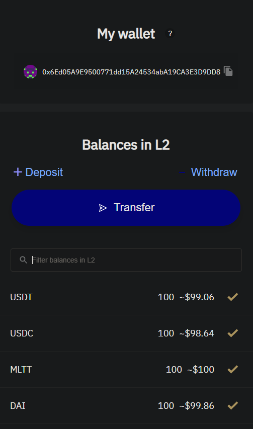
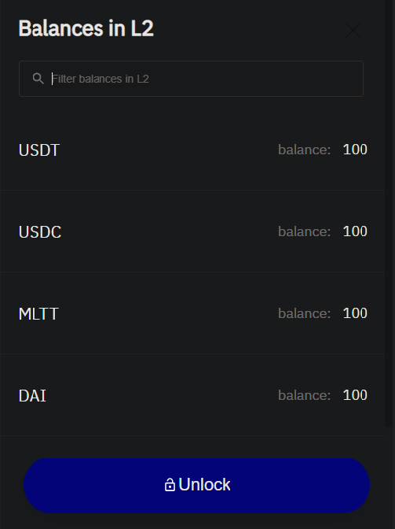

# 故障排除

本章描述了智能合约开发中最常见的问题。当然还有一些解决它们的方法。

## 解锁 zkSync 帐户

```bash,no_run,noplaypen
[ERROR zargo] action failed: HTTP error (422 Unprocessable Entity) Initial transfer: Account is locked
```

***OR***

```bash,no_run,noplaypen
[ERROR zargo] transaction: signing error: Signing key is not set in account
```

当您创建了一个新的 zkSync 帐户并铸造了一些试用令牌时，您应该看到以下界面：



点击 `Transfer` 按钮. 在下一个窗口, 点击 `Unlock` 按钮并按照说明操作.



此序列为您的 zkSync 帐户设置公钥，以便它准备好与您的智能合约帐户进行交互。

## 重置输入数据

```bash,no_run,noplaypen
[ERROR zargo] transaction: signing error: Signing failed: Transfer is incorrect, check amounts
```

在未来的版本中，此错误将变得更加翔实和准确。

修复它的最有效方法是使 `zargo clean` 和 `zargo build`，因为你的 `datainput.json` 文件的某些元素已经过时了。

## 使用唯一的合约名称

```bash,no_run,noplaypen
[ERROR zargo] project uploading request: HTTP error (503 Service Unavailable) Database:
Database(PgDatabaseError { severity: Error, code: "23505", message: "duplicate key value
violates unique constraint \"projects_pkey\"", detail: ... })
```

合约名称、版本和实例必须是唯一的。

要解决此问题，请在`Zargo.toml` manifest中更改您的合同名称或版本，或在发布期间使用其他实例名称。
要查看所有上传的项目，请使用 `zargo download --list` 命令。
