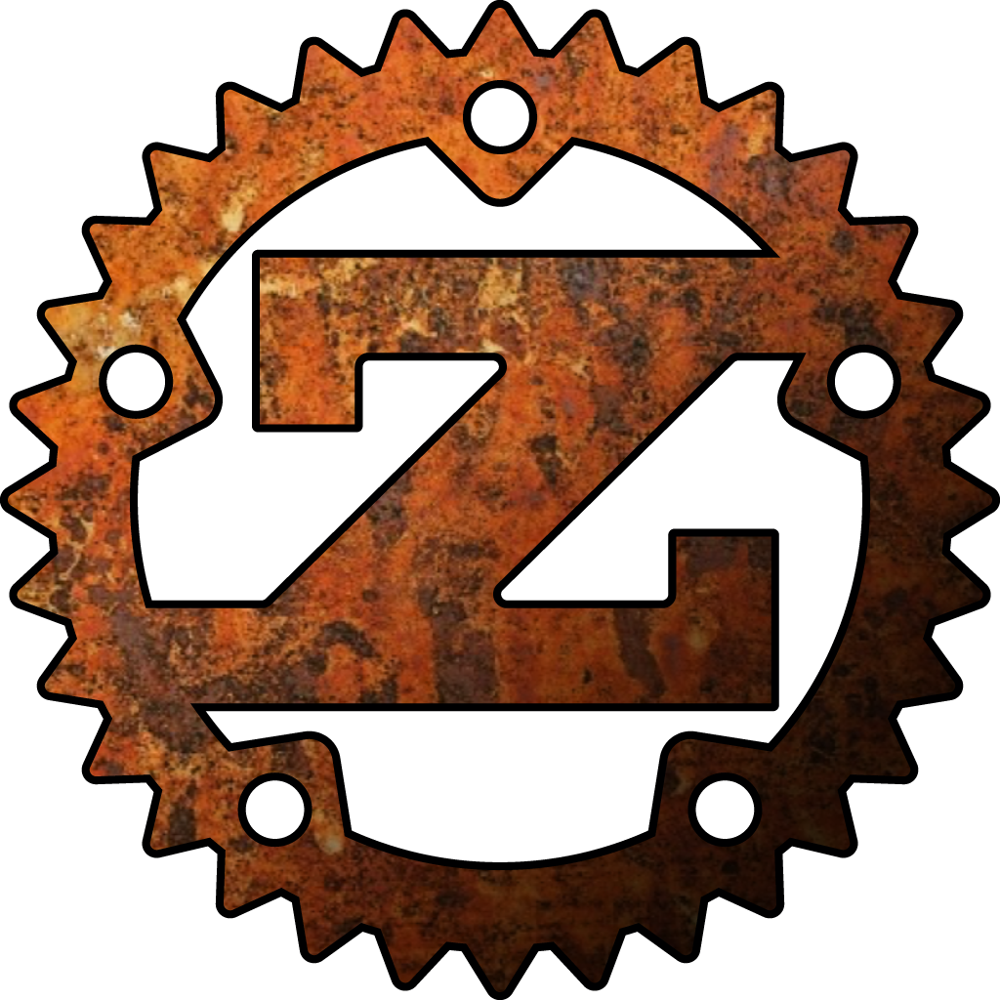

# 介绍

Zinc 是一种编程语言，可以被用来开发:

1)  [zkSync](https://zksync.io) (a ZK Rollup on Ethereum) 的智能合约.
2) 通用零知识证明电路.

现有的 ZKP 框架缺乏特定于智能合约的功能。安全和安全方面对于开发智能合约至关重要，因为它们处理有价值的金融资产。现代智能合约语言，例如 Simplicity 或 Libra's Move，故意做出有利于代码安全性和形式可验证性而不是通用表达性的设计选择。

Zinc 旨在填补两个世界之间的空白：提供一种针对 ZKP 电路优化的智能合约语言，同时可靠且简单，可供大量软件开发人员快速学习。

我们决定借用 Rust 的语法和语义。 Zinc 是 Rust 的一个子集，其细微差别取决于 ZKP 电路的微妙之处。 任何熟悉 Rust、Golang、C++ 或其他类 C 语言的开发人员都可以轻松学习它。 此外，有Solidity 的经验将有助于理解一些智能合约的细节。

该语言正在大力发展，因此它的许多方面最终都会得到改进或改变。 但是，安全性和简单性等基本原则永远不会受到质疑。

# 获取帮助

你可以在我们的聊天频道中提问并获取帮助： [Gitter](https://gitter.im/matter-labs/zinc)

如果你想要迁移现有的项目到 [zkSync](https://zksync.io) 并且需要帮助, 请发送邮件到 [hello@matter-labs.io]().
